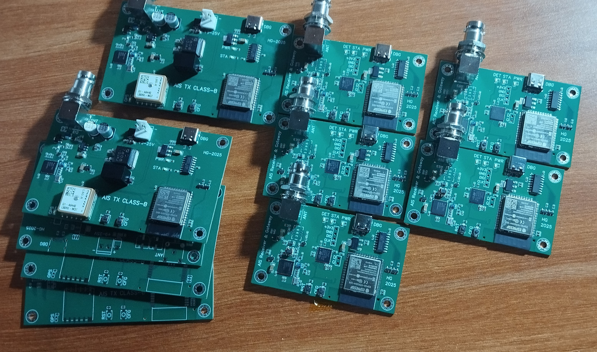

# Low-Cost AIS Class-B Transmitter for Small Vessels
This project is a budget-friendly **Class-B AIS (Automatic Identification System)** Transmitter designed to provide situational awareness for small boats. By utilizing common, off-the-shelf microcontrollers and RF components, this solution ensures supply chain resilience and affordability for maritime operators who find commercial AIS units cost-prohibitive.

_**Note:** This project is a personal recreation and simplified duplication of a professional system I developed in a previous role._

  

## Project Background
Small vessels are often "invisible" to larger ships because they lack active tracking equipment. Many operators forgo AIS installation due to high hardware and licensing costs, which significantly increases the risk of collisions. This project provides a low-cost, open-architecture alternative to help small-scale maritime businesses stay visible and safe.

## Technical Objectives
* **Cost Efficiency:** Engineered to minimize the Bill of Materials (BOM) without sacrificing the ruggedness required for marine environments.
* **Regulatory Compliance:** Designed to adhere to the AIS protocol standards and local maritime regulations for signal timing and frequency accuracy.
* **All-in-One Integration:** A fully self-contained unit housing the AIS logic, GPS module, internal battery, and solar charging circuitry within a single weather-resistant enclosure.

## System Architecture
The transmitter is divided into three primary functional blocks:
1. **AIS Protocol Processor (ESP32):**
   * Acts as the system "brain."
   * Parses real-time position data from the integrated GPS.
   * Constructs valid AIS data packets (Type 18/24 messages).

2. **VHF AIS Transceiver (ADF7021):**
   * Synthesizes the VHF carrier signal.
   * Performs GMSK (Gaussian Minimum Shift Keying) modulation to convert binary packets into RF bursts.

3. **VHF RF Power Amplifier (AFT04MS005):**
   * Uses a high-efficiency RF LDMOS to boost the signal to the 2.5W output required for Class-B AIS compliance.

## Configuration & Maintenance
The ESP32 hosts a built-in Web Server for local management. When "Config Mode" is toggled, users can access a web interface via Wi-Fi to:
* Input vessel-specific data (MMSI, Vessel Name, Call Sign).
* Perform Over-the-Air (OTA) firmware updates to keep the device compliant with evolving standards.

## Testing Result
..
